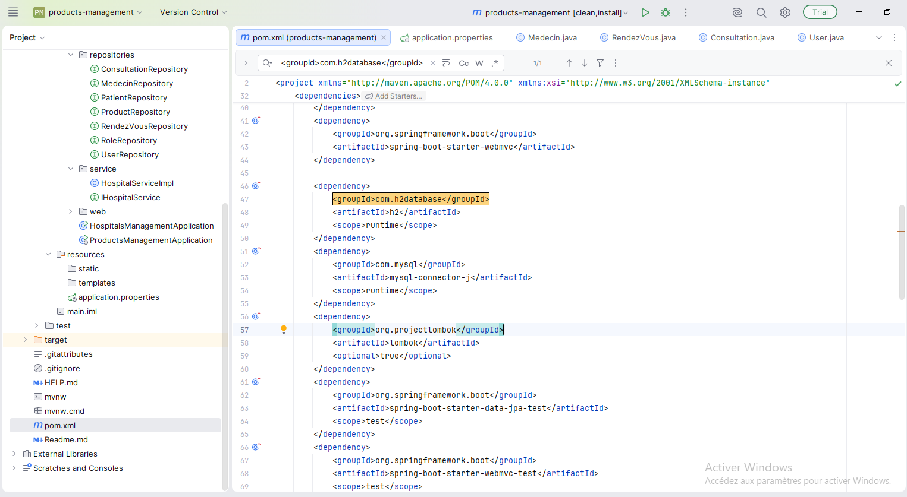
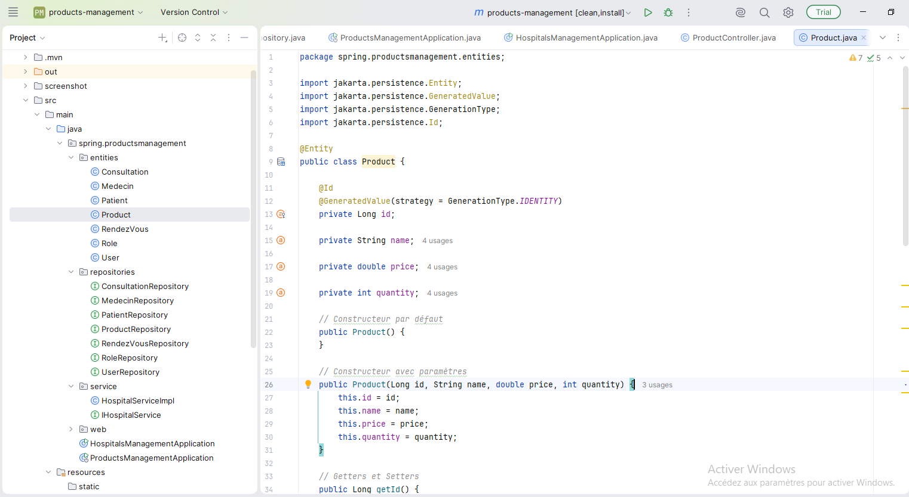
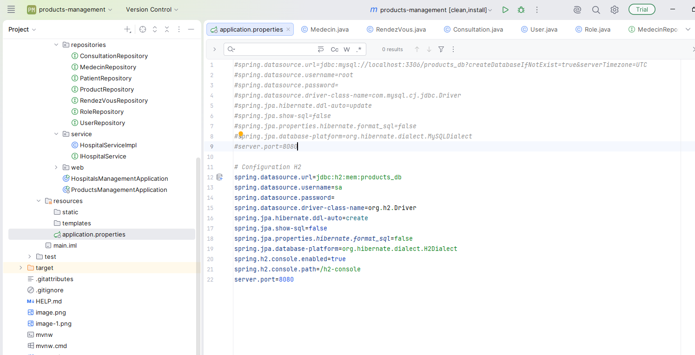
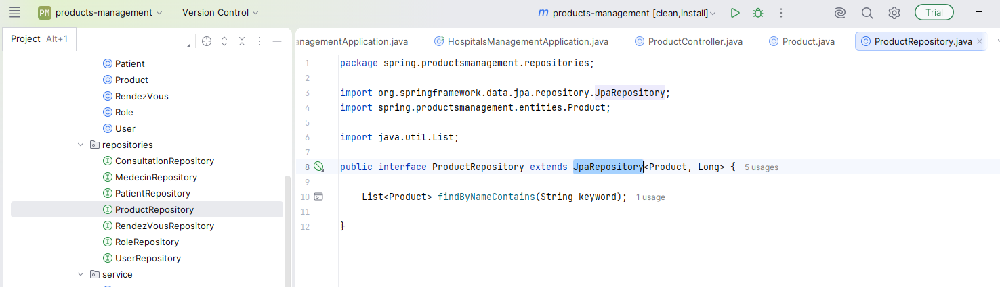
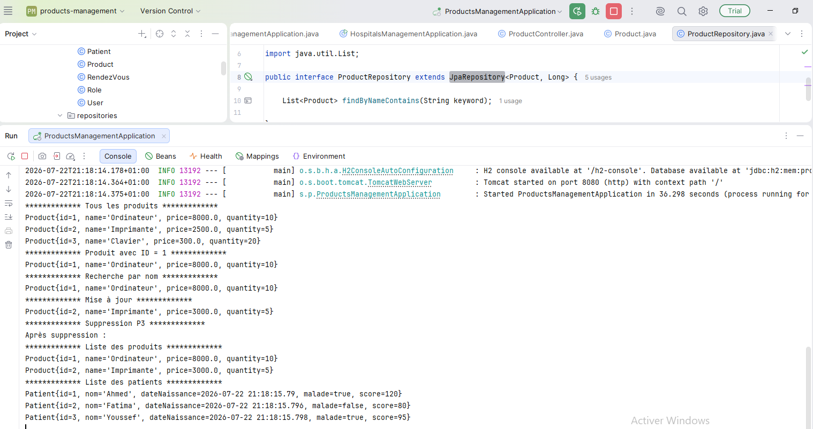
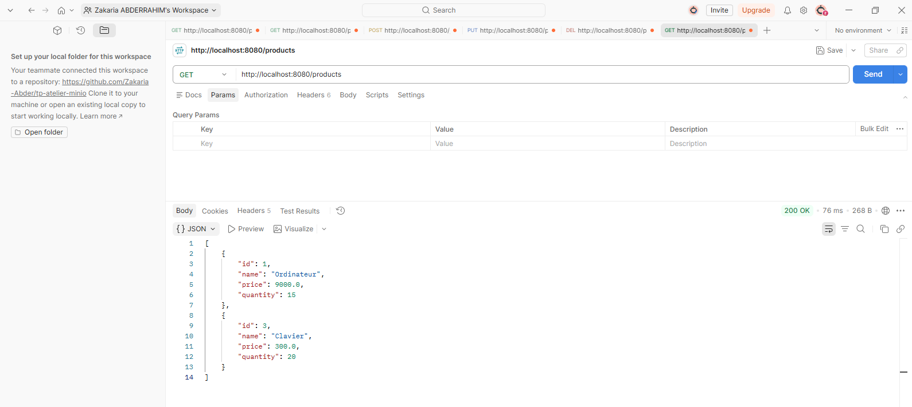
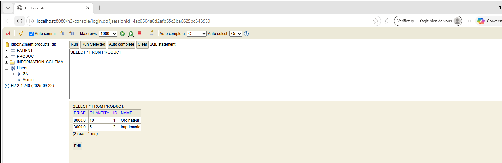
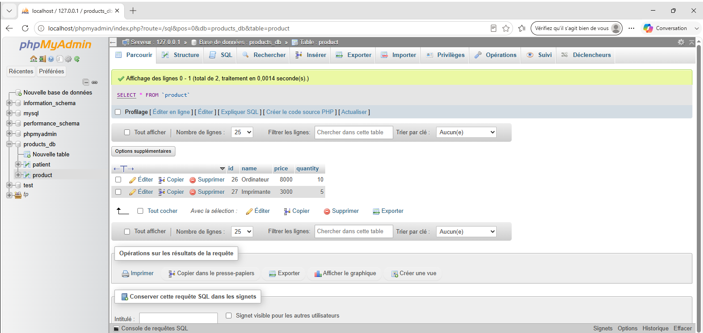
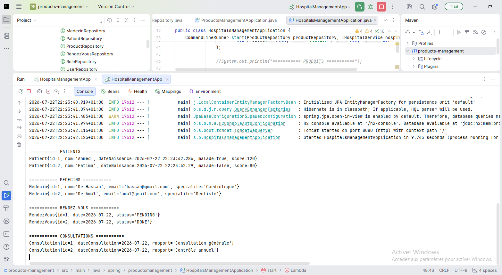

# Activité Pratique N°2 - ORM JPA Hibernate Spring Data

## 1. Installer IntelliJ Ultimate

---

## 2. Créer un projet Spring Initializer

Ajouter les dépendances :

- Spring Data JPA
- H2 Database
- Spring Web
- Lombok

---

## 3. Créer l'entité JPA `Product`

L'entité contient les attributs suivants :

- `id` : Long
- `name` : String
- `price` : double
- `quantity` : int

---

## 4. Configurer l'unité de persistance

Modifier le fichier **application.properties**.

---

## 5. Créer l'interface `ProductRepository`

Créer une interface basée sur **Spring Data JPA**.

---

## 6. Tester les opérations CRUD

Les opérations réalisées sont :

- ✅ Ajouter des produits
- ✅ Consulter tous les produits
- ✅ Consulter un produit
- ✅ Rechercher des produits
- ✅ Modifier un produit
- ✅ Supprimer un produit

### Résultats

---

## 7. Migrer de H2 vers MySQL

### Base H2

### Base MySQL

---

## 8. Reprendre les exemples de la vidéo

Création des entités suivantes :

- Patient
- Médecin
- Rendez-vous
- Consultation
- Users
- Roles

